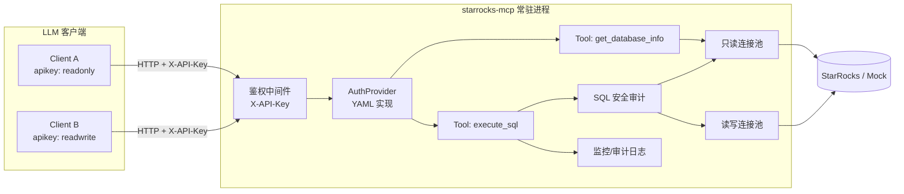

# StarRocks Python MCP Server 实施计划

> 本文档是该项目最初的实施计划（规划阶段产出，保留存档）。计划中的所有事项均已完成并落地到当前代码中；如与实际实现有细微出入，以代码和 [README.md](../README.md) 为准。

**概述**：构建一个独立的 Python 项目 `starrocks-mcp/`，作为常驻的多租户 MCP 服务：通过 Streamable HTTP 暴露给 LLM 客户端，用 HTTP Header 中的 apikey 做鉴权与读写权限映射，内部维护 StarRocks 只读/读写两个连接池，对外提供「数据库结构信息」和「执行 SQL」两个 MCP 工具，并带 SQL 安全审计、监控指标与请求审计日志。当前环境无真实 StarRocks，使用可插拔的 Mock 数据源实现端到端可运行与测试。

**执行状态**：以下事项均已完成 ✅

- [x] 新建 `starrocks-mcp/` 项目骨架、`pyproject.toml`、配置示例文件
- [x] 实现 `AuthProvider` 接口 + YAML 实现 + 鉴权中间件（`X-API-Key` 解析、权限传递）
- [x] 实现 `ConnectionPool` 抽象、`MockConnectionPool`、pymysql+DBUtils 真实实现、线程池桥接与超时控制
- [x] 实现 SQL 安全审计：语句分类、角色规则、LIMIT 注入与收紧、范围校验、多语句拒绝
- [x] 实现 `get_database_info` 与 `execute_sql` 两个 MCP 工具，接入 FastMCP streamable-http server
- [x] 实现 Prometheus 指标 `/metrics` 与 SQLite 审计日志（按 apikey 记录请求）
- [x] 编写 pytest 单测（auth/audit/schema tool/execute tool/metrics+log），跑通全部测试
- [x] 编写 README，说明启动方式、配置、mock 与真实库切换、后续 asyncmy 优化方向
- [x] 提交代码到新分支并创建 PR

---

## 总体架构



关键设计已与用户确认：

- 传输层：MCP 官方 Python SDK，`streamable-http` 传输，长驻进程，多个客户端各自持有 apikey。
- 鉴权：HTTP Header（`X-API-Key`，同时兼容 `Authorization: Bearer`）→ 查 `AuthProvider` → 得到角色（read / readwrite）、可选的 catalog/database 范围限制。
- 权限映射存储：可插拔 `AuthProvider` 接口，初版用本地 YAML 文件实现，方便后续换成真实权限系统。
- 当前环境没有真实 StarRocks：实现一个 `MockConnectionPool`，语义上模拟 `SHOW CATALOGS/DATABASES/TABLES`、`DESCRIBE`、`SELECT ... LIMIT` 等语句的返回结果（直接复用用户给的 `paimon.csc.ods_csc_log_audit` 示例数据），供开发/自动化测试和手动验证使用；同时保留真实 `pymysql + DBUtils.PooledDB` 实现，通过配置切换。

## 项目结构（新建 `starrocks-mcp/`，与现有 TS 项目完全独立）

```
starrocks-mcp/
  pyproject.toml
  README.md
  config/
    settings.example.yaml
    apikeys.example.yaml
  src/starrocks_mcp/
    config.py              # 加载 settings.yaml
    auth/
      models.py            # ApiKeyPermission, ScopeRule
      provider.py          # AuthProvider 接口 + YamlAuthProvider
    db/
      base.py              # ConnectionPool 抽象接口（execute -> columns, rows, rowcount）
      pymysql_pool.py       # 基于 pymysql + DBUtils.PooledDB 的真实实现（读/写各一个）
      mock_pool.py          # Mock 实现，覆盖 SHOW/DESCRIBE/SELECT 场景
      executor.py           # 线程池桥接 sync 驱动到 asyncio，超时控制
    security/
      audit.py              # SQL 分类 + 规则引擎 + LIMIT 注入 + 范围校验
    schema/
      catalog.py            # get_database_info 的分层查询逻辑
    monitoring/
      metrics.py            # prometheus_client 指标
      request_log.py        # SQLite 审计日志（每次请求一条记录）
    server.py               # FastMCP 实例、两个 tool 注册、鉴权中间件挂载
    main.py                 # 启动入口（uvicorn / mcp streamable_http_app）
  tests/
    conftest.py             # mock pool fixture、假 apikeys.yaml
    test_auth.py
    test_audit.py
    test_schema_tool.py
    test_execute_tool.py
    test_metrics_and_log.py
```

## 1. 鉴权与权限映射

`src/starrocks_mcp/auth/models.py`：

```python
@dataclass
class ScopeRule:
    catalog: str
    database: str | None = None

@dataclass
class ApiKeyPermission:
    key_id: str                    # 展示名，不是明文 key
    role: Literal["read", "readwrite"]
    scope: list[ScopeRule] | None  # None = 不限制
    rate_limit_per_min: int | None = None
```

`config/apikeys.example.yaml`（key 用 sha256 哈希存储，服务端收到明文后做哈希再查表，避免明文落盘）：

```yaml
api_keys:
  "sha256:<hash_of_readonly_key>":
    id: bi-team-readonly
    role: read
    scope:
      - catalog: paimon
        database: csc
  "sha256:<hash_of_readwrite_key>":
    id: etl-job
    role: readwrite
    scope: null
```

`YamlAuthProvider.get_permission(raw_api_key) -> ApiKeyPermission | None`：加载一次，之后监听文件 mtime 做热重载（简单实现，非强需求）。

鉴权中间件（挂在 `mcp.streamable_http_app()` 返回的 Starlette app 上，而不是在每个 tool 内部各自检查）：

- 从 `X-API-Key` 或 `Authorization: Bearer` 取值。
- 查 `AuthProvider`，未命中返回 401。
- 命中后将 `ApiKeyPermission` 存入一个 `contextvars.ContextVar`，供后续 tool 处理函数通过 `get_current_permission()` 读取。
- 这样两个 tool 内部都能拿到当前调用者的角色和范围限制，不需要每个 tool 重复做 header 解析。

> 实现备注：最终实现里改为把权限对象挂在 ASGI `scope["state"]` 上（而不是 `contextvars.ContextVar`），通过 `Context.request_context.request` 拿到同一个 Starlette `Request`/scope 读取，效果等价，见 [`src/starrocks_mcp/middleware.py`](../src/starrocks_mcp/middleware.py)。

## 2. 连接池（读/写分离）

`db/base.py` 定义统一接口：

```python
class ConnectionPool(Protocol):
    def execute(self, sql: str, timeout_seconds: float) -> ExecResult: ...
```

`db/pymysql_pool.py`：用 `DBUtils.PooledDB(creator=pymysql, ...)` 分别建两个池：

- 只读池：连到 StarRocks 只读账号，`maxconnections` 较大（如 20）。
- 读写池：连到读写账号，`maxconnections` 较小（如 5），使用更保守。

`db/mock_pool.py`：不发起网络连接，按语句模式匹配返回固定数据，覆盖：

- `SHOW CATALOGS` → `default_catalog`, `paimon`
- `SHOW DATABASES FROM paimon` → `csc`（对应用户提供的真实返回）
- `SHOW TABLES FROM paimon.csc` → `ods_csc_log_audit` 等
- `DESCRIBE paimon.csc.ods_csc_log_audit` → 列出 `app_id`, `year`, `month`, `day`, `log_time`, `log_content` 等列
- 匹配用户给的 `SELECT ... WHERE app_id=... AND year=... LIMIT 2` → 返回 2 条构造数据

`db/executor.py`：所有 DB 调用通过 `loop.run_in_executor(ThreadPoolExecutor, pool.execute, sql, timeout)` 执行，避免同步驱动阻塞事件循环；`future` 超时由 `asyncio.wait_for` 包一层，超时返回错误（并记录，说明底层连接可能仍在执行，属已知限制）。

## 3. SQL 安全审计（`security/audit.py`）

用 `sqlparse` 做语句拆分与分类：

- 拒绝多语句（一次只允许一条 SQL，防止堆叠注入）。
- 自定义分类器（`sqlparse.get_type()` 对 SHOW/DESCRIBE/EXPLAIN 识别不准，需要额外按首关键字判断）：`SELECT` / `SHOW` / `DESCRIBE|DESC` / `EXPLAIN` / `INSERT` / `UPDATE` / `DELETE` / 其他。
- 角色规则：
  - `read`：只允许 `SELECT`, `SHOW`, `DESCRIBE`, `EXPLAIN`。
  - `readwrite`：以上 + `INSERT`, `UPDATE`, `DELETE`。
  - 任何角色都禁止：`DROP`, `TRUNCATE`, `ALTER`, `CREATE`, `GRANT`, `REVOKE`, `LOAD`, `RENAME`, `KILL`, `SET`（v1 不开放高危 DDL/DCL 白名单）。
- 范围校验（可选，取决于 apikey 的 `scope`）：从 `FROM`/`JOIN` 子句 best-effort 提取 `catalog.database.table`，与 `scope` 比对；无法可靠解析且配置了 scope 限制时，**fail-closed**（拒绝执行并提示原因），而不是放行。
- `SELECT` 自动保护：没有 `LIMIT` 时自动追加默认上限（如 1000）；已有 `LIMIT` 超过硬上限（如 10000）时收紧到硬上限，并在返回结果里标注 `limit_applied` / `truncated`。
- 语句级超时：默认 30s，可通过配置调整。

连接池选择：`SELECT/SHOW/DESCRIBE/EXPLAIN` 一律走只读池（即使调用方是 readwrite key，也不占用读写池）；`INSERT/UPDATE/DELETE` 必须角色为 `readwrite` 且走写池。

## 4. 两个 MCP 工具

**工具 1：`get_database_info`**（结构理解，只读，不经过 execute_sql 的审计流程，但仍受 apikey 的 scope 过滤）

- 参数（均可选）：`catalog`、`database`、`table`。
- 行为分层：
  - 都不传 → `SHOW CATALOGS`（按 apikey scope 过滤结果）
  - 传 `catalog` → `SHOW DATABASES FROM <catalog>`
  - 传 `catalog`+`database` → `SHOW TABLES FROM <catalog>.<database>`
  - 传 `catalog`+`database`+`table` → `DESCRIBE <catalog>.<database>.<table>`；若为内部 catalog（`default_catalog`）的表，额外执行 `SHOW CREATE TABLE` 提取分区键/分桶信息；外部 catalog（如 `paimon`）只返回列信息，不假设有 StarRocks 原生的分桶/主键概念。
- 返回统一 JSON，包含 `level`（catalogs/databases/tables/columns）字段，方便 LLM 判断下一步该传什么参数。

**工具 2：`execute_sql`**（真正执行）

- 参数：`sql`（必填）、可选 `max_rows`、可选 `timeout_seconds`（均有硬上限，不能被参数突破安全审计阈值）。
- 流程：读取当前 apikey 权限 → 安全审计（分类、角色校验、范围校验、LIMIT 注入）→ 选择连接池 → 执行 → 记录指标与审计日志 → 返回 `{columns, rows, row_count, execution_time_ms, statement_type, pool_used, limit_applied}` 或结构化错误。

## 5. 监控与审计日志

- `monitoring/metrics.py`：用 `prometheus_client` 暴露 `/metrics`：
  - `mcp_sql_requests_total{api_key_id, statement_type, status}`
  - `mcp_sql_duration_seconds{api_key_id, statement_type}`（Histogram）
  - `mcp_sql_rows_returned`（Histogram）
  - `mcp_pool_in_use{pool="read"|"write"}`（Gauge）
- `monitoring/request_log.py`：每次 `execute_sql` 调用写一条记录到本地 SQLite（`logs/audit.db`，表 `request_log`：`id, ts, api_key_id, statement_type, sql_text, pool, duration_ms, row_count, status, error`），方便按 apikey 查历史请求；SQL 文本按配置长度截断，避免日志过大。

## 6. 并发模型

- 默认：同步 `pymysql` + `DBUtils.PooledDB`（读/写各一个池）+ 独立 `ThreadPoolExecutor`（线程数配置为两池 `maxconnections` 之和左右），通过 `run_in_executor` 桥接进异步的 MCP 处理流程。实现简单、稳定，能覆盖中等并发（几十到上百并发查询）。
- 如果后续实测 QPS 更高、线程调度成为瓶颈，可以将 `db/pymysql_pool.py` 换成基于 `asyncmy`（原生异步 MySQL 协议驱动，兼容 StarRocks）的实现，接口不变，上层代码无需改动——这一步先不做，作为预留的性能优化方向记录在 README。

## 7. Mock 与测试

- `db/mock_pool.py` 让整个服务在没有真实 StarRocks 时也能跑起来（配置 `database.driver: mock`），复现用户给出的 `paimon.csc.ods_csc_log_audit` 示例查询链路，用于手动验证。
- `tests/`：
  - `test_auth.py`：YAML 加载、命中/未命中、scope 解析。
  - `test_audit.py`：不同角色对各语句类型的允许/拒绝、LIMIT 自动注入与收紧、多语句拒绝、范围校验 fail-closed。
  - `test_schema_tool.py`：mock 池下四种参数组合的返回结构。
  - `test_execute_tool.py`：readonly key 跑 SELECT 成功 / 跑 INSERT 被拒；readwrite key 跑 INSERT 成功并走写池；超时路径。
  - `test_metrics_and_log.py`：调用后 Prometheus 计数增加、SQLite 审计记录落地。
- 用 `pytest` + `pytest-asyncio`。

## 8. 配置与依赖

`config/settings.example.yaml`（要点，非表格）：

- `server.transport: streamable-http`, `server.host/port`
- `database.driver: mock|pymysql`，读账号/写账号的 host/port/user/password（密码走环境变量占位）
- `security.default_row_limit`、`max_row_limit`、`query_timeout_seconds`、`blocked_keywords`
- `monitoring.audit_db_path`、`metrics_enabled`

依赖（`pyproject.toml`）：`mcp`（官方 SDK）、`pymysql`、`DBUtils`、`sqlparse`、`PyYAML`、`prometheus-client`、`uvicorn`；开发依赖：`pytest`、`pytest-asyncio`、`httpx`。

## 执行顺序

1. 搭建项目骨架与配置加载（`config.py`、YAML 示例）
2. 实现 `AuthProvider` + 鉴权中间件
3. 实现 `ConnectionPool` 抽象 + Mock 实现（先保证端到端可跑）
4. 实现 SQL 安全审计模块
5. 实现两个 MCP 工具并接入 FastMCP server
6. 接入监控指标与审计日志
7. 补充 `pymysql` 真实连接池实现（供接入真实 StarRocks 时切换）
8. 编写测试，跑通 pytest
9. 编写 README（启动方式、配置说明、如何切换 mock/真实库）
10. 提交并创建 PR
