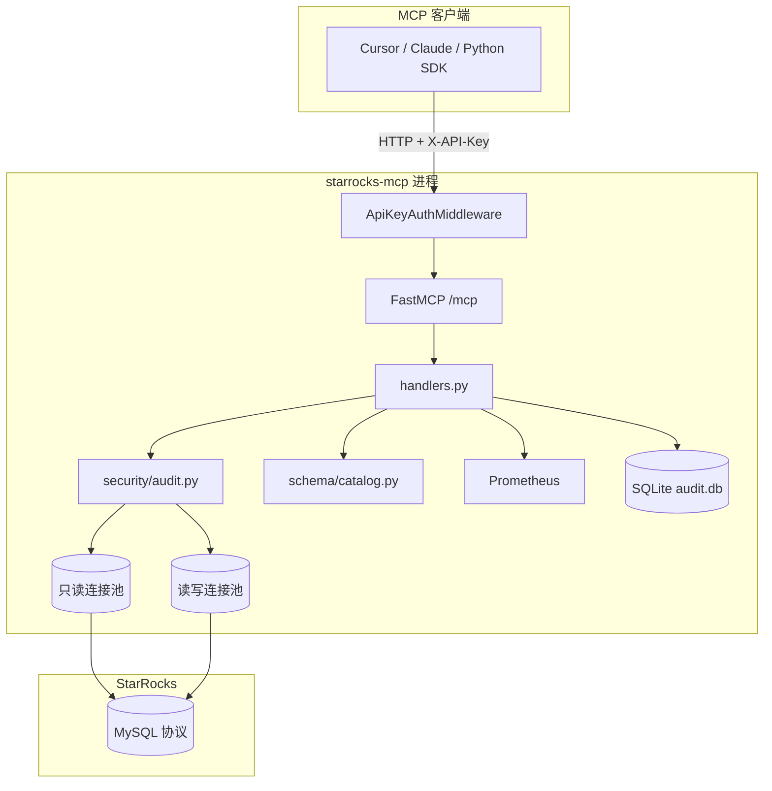

# starrocks-mcp 项目说明

## 1. 项目定位

**starrocks-mcp** 是一个面向 StarRocks 的 [MCP（Model Context Protocol）](https://modelcontextprotocol.io/) 服务，作为 LLM 与 StarRocks 之间的统一 SQL 网关。

典型使用场景：

- 在 **Cursor、Claude Desktop** 等支持 MCP 的客户端中，让 AI 助手查询 StarRocks 数据、理解表结构。
- 为多个团队/应用提供 **多租户** 查询入口：每个客户端持有一个 apikey，服务端按 key 做鉴权与权限隔离。
- 在 LLM 可能生成不可预测 SQL 的前提下，通过 **安全审计** 限制可执行语句类型、访问范围和返回行数。

与直接在客户端配置数据库连接相比，本项目的核心差异：

| 维度 | 直连数据库 | starrocks-mcp |
|------|-----------|---------------|
| 凭证暴露 | 客户端持有 DB 账号密码 | 客户端只持有 apikey；真实 DB 账号仅在服务端 |
| 权限模型 | 依赖 DB 账号权限 | apikey 角色 + scope + SQL 审计多层约束 |
| 审计 | 依赖 DB 审计日志 | 按用户名记录每次 `execute_sql` 到 SQLite |
| 协议 | 各客户端自行集成 | 统一 MCP Streamable HTTP |

当前版本：**0.1.0**（见 `pyproject.toml`）。

---

## 2. 核心能力

- **Streamable HTTP 常驻服务**：默认监听 `0.0.0.0:8080`，端点 `/mcp`。
- **apikey 鉴权**：HTTP Header `X-API-Key`（兼容 `Authorization: Bearer`）。
- **读写分离连接池**：只读账号处理查询类语句；读写账号处理 `INSERT`/`UPDATE`/`DELETE`。
- **三个 MCP 工具**：
  - `get_connection_status` — 探测数据库连通性
  - `get_database_info_tool` — 分层浏览 catalog / database / table / columns
  - `execute_sql` — 执行 SQL（内置安全审计）
- **安全审计**：角色白名单、scope 校验、DDL 禁止、单语句、LIMIT 保护。
- **可观测性**：Prometheus 指标（`/metrics`）、SQLite 审计日志、健康检查（`/healthz`）。
- **Mock 模式**：无真实 StarRocks 时可跑通完整链路，便于开发与 CI。

---

## 3. 系统架构



### 请求处理流程（`execute_sql`）

1. **鉴权中间件**解析 apikey → `ApiKeyPermission`（用户名、角色、scope）。
2. **安全审计** `audit_sql()`：分类语句 → 角色校验 → DDL 拦截 → scope 校验 → LIMIT 处理。
3. **连接池路由**：查询类走只读池；写操作走读写池。
4. **线程池执行**：同步 `pymysql` 通过 `run_in_executor` 桥接到 asyncio。
5. **记录指标与审计日志**：无论成功/拒绝/超时均写入 Prometheus 与 SQLite。

---

## 4. 目录与模块

```
starrocks-mcp/
├── config/                    # 配置模板（*.example.yaml / *.local.yaml）
├── docs/                      # 文档
├── scripts/                   # 启动、打包、离线安装脚本
├── src/starrocks_mcp/
│   ├── main.py                # CLI 入口（uvicorn）
│   ├── server.py              # 组装 ASGI 应用（FastMCP + 中间件 + 运维端点）
│   ├── middleware.py          # apikey 鉴权 ASGI 中间件
│   ├── handlers.py            # 三个 MCP 工具的业务逻辑（可单测）
│   ├── config.py              # 加载 settings.yaml
│   ├── auth/                  # apikey → 权限（YamlAuthProvider，可插拔）
│   ├── db/                    # 连接池抽象、mock、pymysql 实现、执行器
│   ├── security/audit.py      # SQL 安全审计
│   ├── schema/catalog.py      # get_database_info 分层查询
│   └── monitoring/            # Prometheus + SQLite 审计日志
└── tests/                     # pytest（全部基于 Mock，无需真实库）
```

| 模块 | 职责 |
|------|------|
| `middleware.py` | 在进入 MCP 协议前校验 apikey；无效 key 直接 401 |
| `auth/provider.py` | 从 YAML 加载用户↔apikey 映射，支持热重载 |
| `security/audit.py` | SQL 审计规则引擎 |
| `schema/catalog.py` | 按 catalog 层级查询结构，并按 scope 过滤 |
| `db/pymysql_pool.py` | DBUtils 连接池 + 真实 StarRocks 连接 |
| `db/mock_pool.py` | 本地/测试用构造数据 |
| `handlers.py` | 与 FastMCP 解耦，方便单元测试与集成测试 |

---

## 5. 安全设计

### 5.1 鉴权层

- 配置文件只存 apikey 的 **SHA-256 哈希**（`sha256:<hex>`），不存明文。
- 客户端在 Header 传明文 apikey，服务端哈希后查表。
- 映射到业务 **username**，审计日志以用户名为准。

### 5.2 角色与语句白名单

| 角色 | 允许的语句类型 |
|------|----------------|
| `read` | `SELECT`、`SHOW`、`DESCRIBE`、`EXPLAIN` |
| `readwrite` | 上述 + `INSERT`、`UPDATE`、`DELETE` |

### 5.3 一律禁止（任何角色）

`DROP`、`TRUNCATE`、`ALTER`、`CREATE`、`GRANT`、`REVOKE`、`LOAD`、`RENAME`、`KILL`、`SET` 等（见 `security.blocked_keywords`）。v1 **无覆盖开关**。

### 5.4 访问范围（scope）

在 `apikeys.yaml` 中按 **catalog + database** 配置可见范围（v1 不支持表级 scope）。

- SQL 中引用的表必须在 scope 内（best-effort 正则解析）。
- 无法可靠解析引用表时，默认 **fail-closed 拒绝**（`fail_closed_on_unresolvable_scope: true`）。
- `scope: null` 表示不限制（通常给受信任的读写账号）。

`get_database_info_tool` 同样受 scope 约束：越权 catalog/database 会返回权限错误。

### 5.5 LIMIT 保护

| 情况 | 行为 |
|------|------|
| SELECT 未写 LIMIT | **不拒绝**，自动注入 `default_row_limit`（默认 1000） |
| LIMIT 在合理范围内 | 保持用户指定值 |
| LIMIT 超过 `max_row_limit` | 收紧到硬上限（默认 10000） |

### 5.6 其他规则

- **单语句**：拒绝 `SELECT 1; DROP TABLE x` 等多语句堆叠。
- **连接池隔离**：即使 `readwrite` key，查询类语句仍走只读池，避免占用写连接。
- **超时**：`query_timeout_seconds`（默认 30s）；注意超时后底层线程中的 SQL 可能仍在库侧执行，建议在 StarRocks 侧也配置查询超时。

### 5.7 已知安全限制

| 项目 | 说明 |
|------|------|
| scope 解析 | 基于正则，复杂 SQL（子查询、动态表名）可能误判 |
| 表级权限 | v1 仅 catalog/database 级 |
| 限流 | `rate_limit_per_min` 已解析配置，**尚未实现** |
| DDL 兜底 | 依赖审计层 + DB 账号最小权限，建议 StarRocks 侧也不授予 DDL |

---

## 6. 配置体系

两份独立配置：

| 文件 | 内容 |
|------|------|
| `config/settings.yaml` | 服务监听、数据库连接、连接池、安全参数、监控路径 |
| `config/apikeys.yaml` | 用户、apikey 哈希、角色、scope |

`settings.yaml` 支持 `${ENV_VAR}` 占位符注入密码，避免明文入库。

`database.driver` 决定运行模式：

| driver | 说明 |
|--------|------|
| `mock` | 返回构造数据，不连网 |
| `pymysql` | 连接真实 StarRocks（MySQL 协议） |

---

## 7. 技术选型

| 组件 | 选型 | 说明 |
|------|------|------|
| MCP 框架 | FastMCP | Streamable HTTP 传输 |
| HTTP 服务 | uvicorn + Starlette | ASGI |
| DB 驱动 | pymysql + DBUtils | 同步连接池，线程池桥接 asyncio |
| SQL 解析 | sqlparse | 语句分类与拆分 |
| 监控 | prometheus-client | `/metrics` |
| 审计存储 | SQLite | 本地 `logs/audit.db` |

**性能预期**：适合中等并发（几十到上百 QPS）。更高并发可考虑将 `pymysql_pool.py` 替换为 `asyncmy` 等异步驱动，连接池接口 `db/base.py` 保持不变。

---

## 8. 测试

```bash
pip install -e ".[dev]"
pytest -v
```

| 测试文件 | 覆盖内容 |
|----------|----------|
| `test_audit.py` | SQL 审计规则（角色、LIMIT、scope、多语句） |
| `test_auth.py` | apikey 解析、热重载 |
| `test_schema_tool.py` | 结构查询与 scope |
| `test_execute_tool.py` | execute_sql 业务逻辑、审计日志 |
| `test_app_integration.py` | **E2E**：HTTP + MCP 全链路安全与功能 |
| `test_connectivity.py` | 连通性探测 |
| `test_metrics_and_log.py` | 指标与日志模块 |

全部测试基于 Mock 数据源，CI 无需真实 StarRocks。

---

## 9. 文档索引

| 文档 | 说明 |
|------|------|
| [使用指南.md](使用指南.md) | 安装、配置、Cursor 接入、运维、常见问题 |
| [api.md](api.md) | MCP 工具与 HTTP 端点接口说明 |
| [local-cursor.md](local-cursor.md) | 本机 Cursor 快速接入 |
| [deploy-intranet.md](deploy-intranet.md) | 内网离线部署 |
| [plan.md](plan.md) | 原始实施计划（存档） |

---

## 10. 版本与路线图（简要）

**v0.1.0 已具备：**

- 多租户 apikey 鉴权、读写分离、SQL 安全审计
- 三个 MCP 工具 + 健康检查 + Prometheus + SQLite 审计
- Mock 模式与内网离线部署包

**后续可考虑：**

- 实现 `rate_limit_per_min` 限流
- 表级 scope
- 异步驱动（asyncmy）提升并发
- 可选只读池单账号部署（无写账号时）
